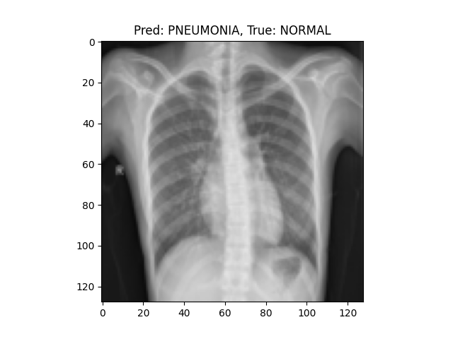
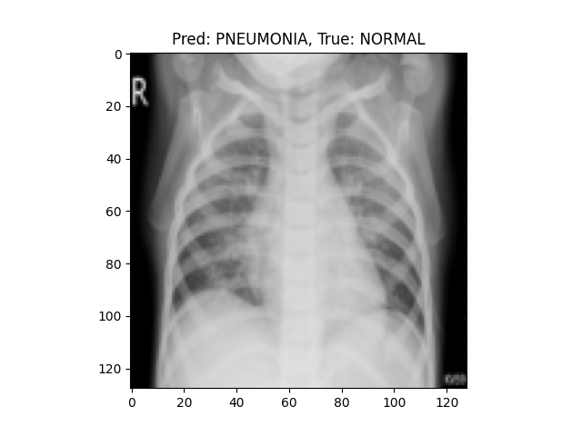
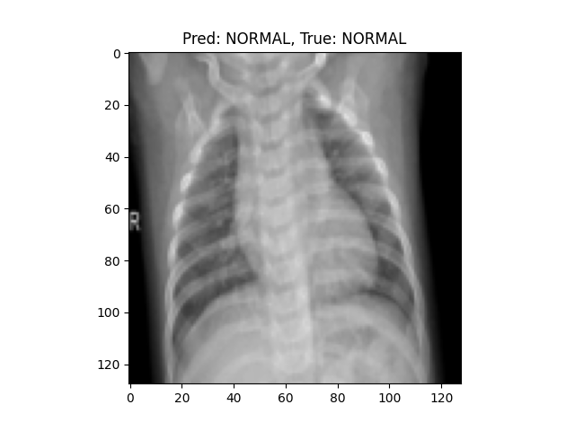
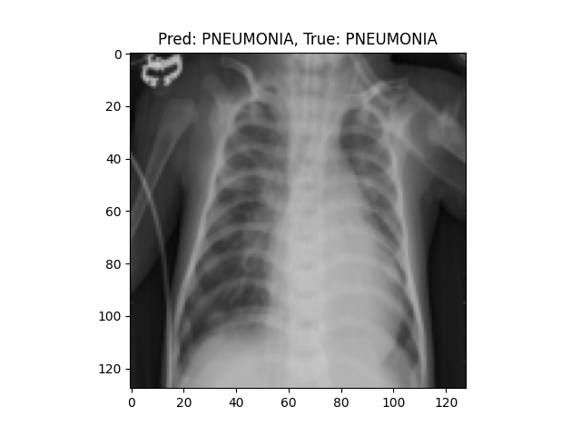
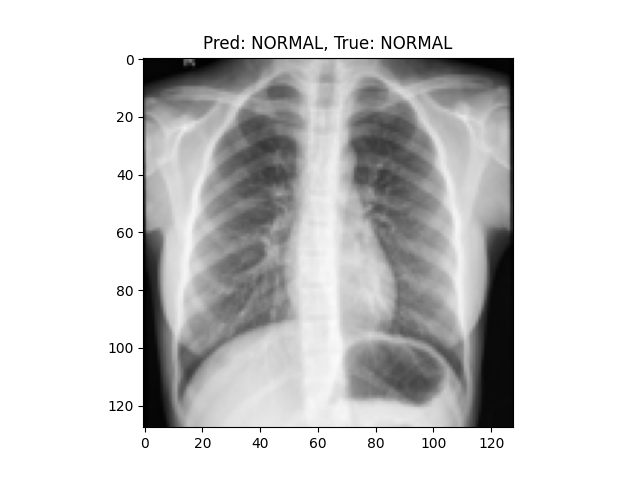
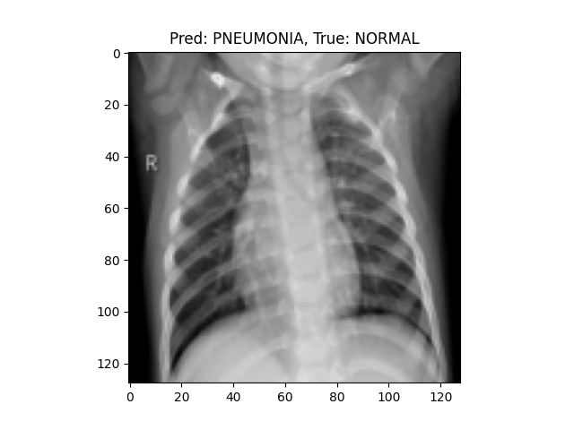

# Chest-Xray-Pneumonia-Classification

Chest X-ray pneumonia detection using deep learning with PyTorch.

## Project Overview

This project demonstrates an end-to-end medical image classification pipeline using chest X-ray images. The task is binary classification between `NORMAL` and `PNEUMONIA`.

## Key Features

- Medical image preprocessing pipeline
- CNN-based classification model in PyTorch
- Training, validation, and test evaluation
- Prediction visualization
- Simple realtime webcam demo

## Dataset

The project uses the Kaggle Chest X-Ray Images (Pneumonia) dataset:

- Source: https://www.kaggle.com/datasets/paultimothymooney/chest-xray-pneumonia/data
- Expected layout:

```text
data/
  chest_xray/
    train/
      NORMAL/
      PNEUMONIA/
    val/
      NORMAL/
      PNEUMONIA/
    test/
      NORMAL/
      PNEUMONIA/
```

## Model

The current model is a small custom CNN:

- 2 convolution layers
- Max pooling after each convolution
- 2 fully connected layers

Input images are resized to `128x128`.

## Run

Train:

```bash
python -m src.train
```

Evaluation:

```bash
python -m src.evaluate
```

Detailed analysis:

```bash
python -m src.analysis
```

Prediction visualization:

```bash
python -m src.predict
```

Realtime inference:

```bash
python -m src.realtime_inference
```

Press `q` to close the webcam window.

## Project Structure

```text
MedImage-AI-Demo/
|-- data/
|   `-- chest_xray/
|-- examples/
|-- src/
|   |-- dataset.py
|   |-- model.py
|   |-- train.py
|   |-- evaluate.py
|   |-- predict.py
|   `-- realtime_inference.py
|-- model.pth
|-- requirements.txt
`-- README.md
```
## Example outputs:

| Prediction | Ground Truth |
| ---------- | ------------ |
| PNEUMONIA  | NORMAL       |
| NORMAL     | NORMAL       |


(See `/examples` folder for sample outputs)

| Case 1 (Normal) | Case 2 (Normal) | Case 3 (Normal) |
| :---: | :---: | :---: |
|  |  |  |
| **Pred: PNEUMONIA** | **Pred: PNEUMONIA** | **Pred: NORMAL** |
| (Label: NORMAL) | (Label: NORMAL) | (Label: NORMAL) |

| Case 4 (Pneumonia) | Case 5 (Normal) | Case 6 (Pneumonia) |
| :---: | :---: | :---: |
|  |  |  |
| **Pred: PNEUMONIA** | **Pred: NORMAL** | **Pred: PNEUMONIA** |
| (Label: PNEUMONIA) | (Label: NORMAL) | (Label: NORMAL) |

## Notes

- Training now uses the `val` split to track validation performance.
- The best validation checkpoint is saved to `model.pth`.
- Scripts are designed to be run as modules from the project root.
- `src.analysis` saves `examples/confusion_matrix.png` and `examples/roc_curve.png`.
